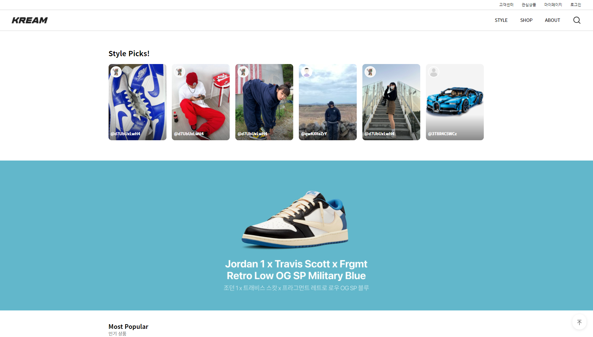
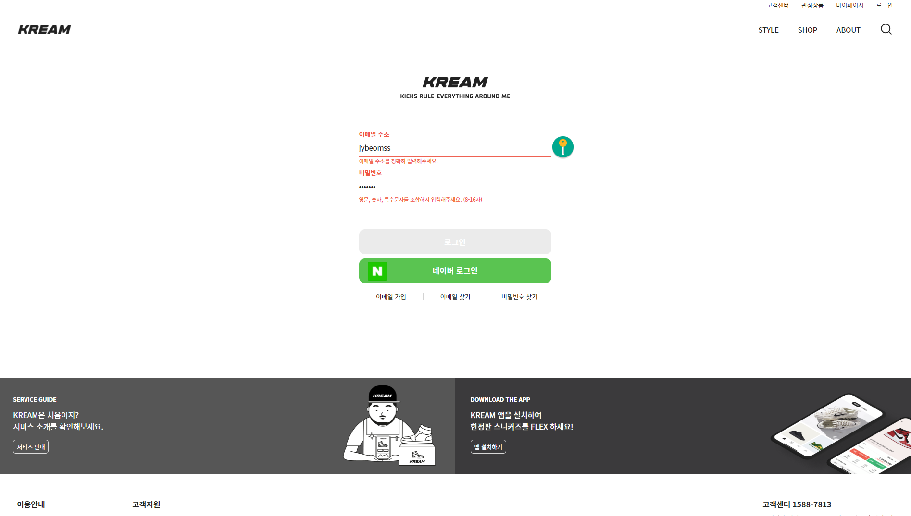
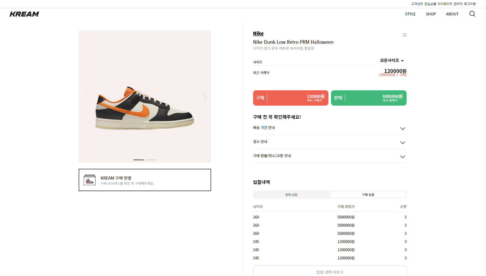
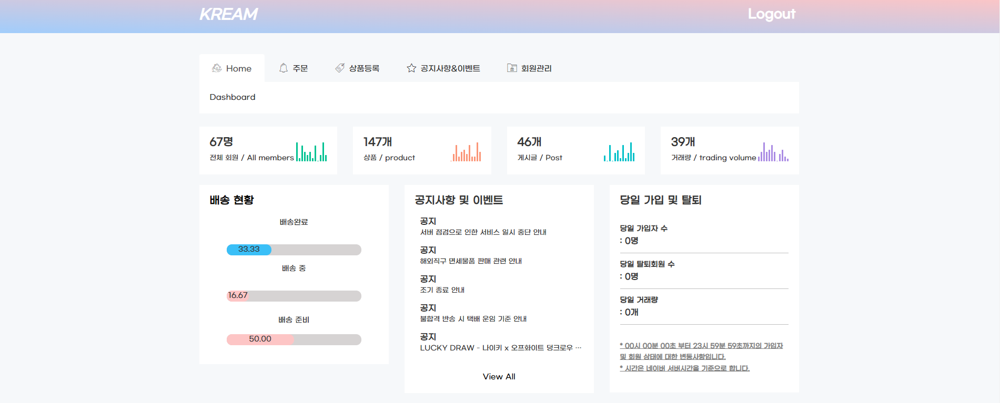
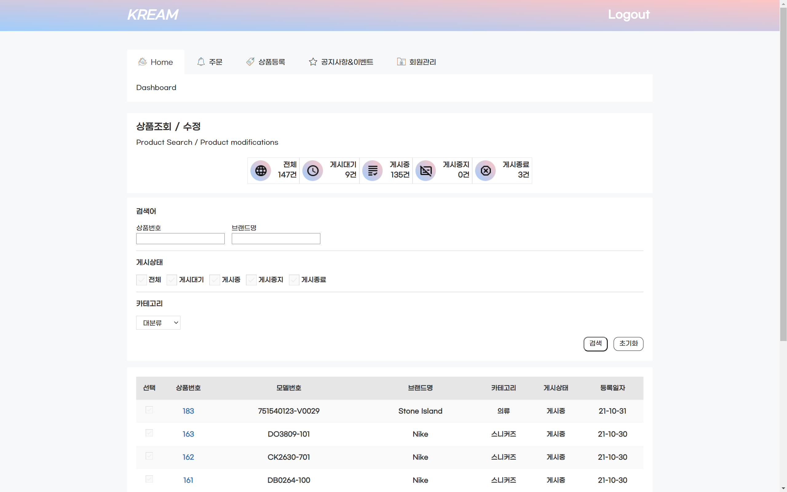

# KREAM 클론코딩 / Spring-Boot, Oracle
 * 개발 기간 : 2021.07.30 ~ 2021.10.31
 * 주제 : 한정판 리셀(KREAM)
 * 개발 : IntelliJ, Oracle , Visual Studio code
 * 사용 언어 : Java(JDK), Oracle SQL, HTML5, CSS3, Javascript(ES6)
 * 사용 기술 : JDBC,Thymeleaf,jQuery,Ajax,Spring-Boot(2.5),Mail API,JPA/Hiberrate, Restful API, QueryDSL
  

## <b>프로젝트 상세내용</b> ##
> 기획 목표
- 한정판 중고 거래를 위한 중개 플랫폼
- 가격별 제품 오름차순, 내림차순
- 브랜드, 사이즈, 색상 및 컬렉션 별 제품 필터링
- 단순 구매 및 판매 + 입찰 시스템 구현
  

## <b>구현목표</b> ##
> 사용자 페이지
1. 입찰 시스템 구현(구매입찰/판매입찰)
2. 상품별 최근/평균 가격 구현
3. SNS와 같은 게시물 등록/수정 기능 구현
4. 해당 게시물과 댓글에 좋아요/댓글/팔로우 기능 구현
5. 세분화된 필터(다중필터)

>관리자 페이지
1. 회원관리(전체회원/탈퇴회원/블랙리스트)
2. 배송현황 관리
3. 문의 및 공지사항 관리
4. 상품관리(상품 등록/수정 및 게시상태)
  

## <b>구동 화면</b> ##
> 사용자 페이지
* 메인(/)

  
* 로그인(/login)

  
* 상품(/search)

  
* 입찰 시스템(/product/상품번호, /kream/buying/상품번호/사이즈)

  
* 스타일(/social/trending)
 
  
* 스타일 게시물 클릭시 보여지는 페이지(./img/popular)

  
  

> 관리자 페이지
* 대시보드(/pages)
 
* 주문(/pages/order/search)
 
* 상품등록(/pages/product/check)

* 공지사항(/pages/content/manage)

* 회원관리(/pages/member/all)

## 시연 영상 ##

